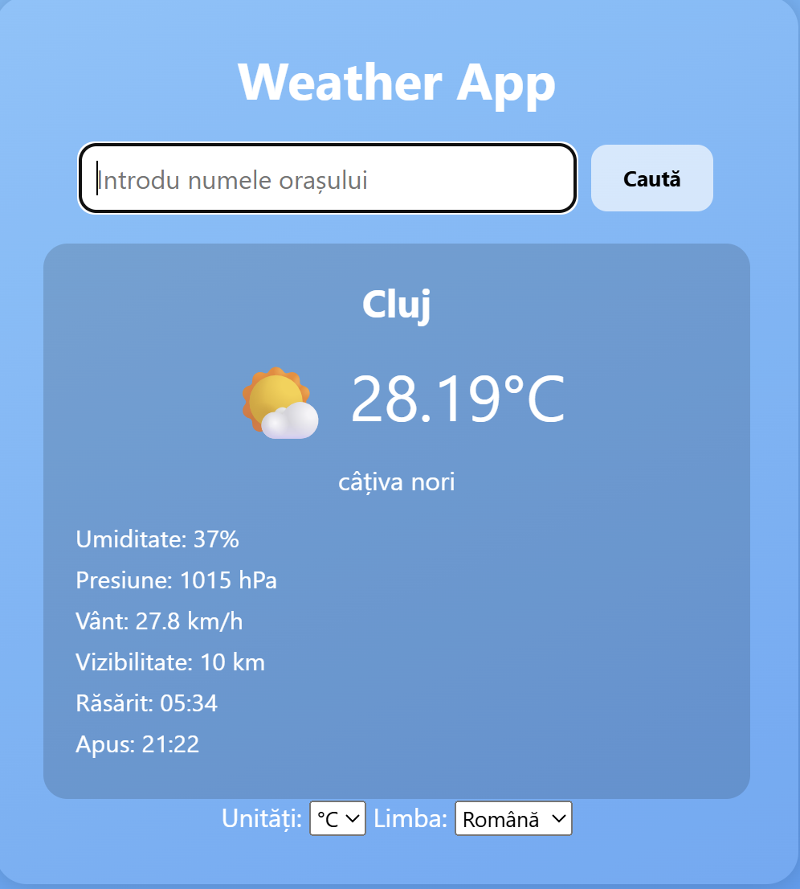
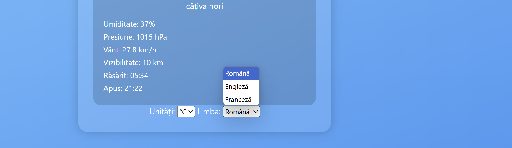

# Weather App – Aplicație Meteo

Aceasta este o aplicație meteo simplă și intuitivă, construită cu **HTML**, **CSS** și **JavaScript**, care oferă informații despre vreme folosind API-ul de la [OpenWeatherMap](https://openweathermap.org/).

## Funcționalități

- 🔍 Căutare vreme după numele orașului
- 🌡️ Selectare unități: Celsius (°C) sau Fahrenheit (°F)
- 🌐 Selectare limbă: Română, Engleză sau Franceză
- 💾 Salvare preferințe în `localStorage`
- 🔄 Fallback cu date simulate în caz de eroare sau lipsă conexiune

## 📸 Capturi ecran

| Căutare oraș | Preferințe utilizator |
|--------------|------------------------|
|  |  |

> *P.S.: Adaugă imaginile reale în folderul `screenshots/` din proiectul tău pentru a apărea corect aici.*

## Tehnologii utilizate

- ✅ HTML5
- ✅ CSS3 (Flexbox + Gradiente)
- ✅ JavaScript ES6+ (modular, async/await)
- ✅ API REST [OpenWeatherMap](https://openweathermap.org/)

## Cum rulezi aplicația

1. Clonează proiectul:
   ```bash
   git clone https://github.com/ValentinaStroea/weather-app.git
